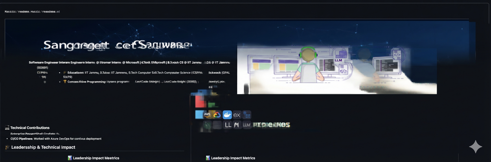

 
  

  

  

  
  

  

 

## 👨‍💻 Quick Intro

<table>
  <tr>
    <td width="60%" valign="top">
       
      <b>Software Engineer Intern @ HumanAI | B.Tech @ MDU Rohtak</b>
        
      <ul>
        <li>🔭 <b>Experience:</b> Ex Engineering Intern at HumanAI (Gurugram/Remote), focusing on AI Email Personalization & RAG Optimization.</li>
        <li>🎓 <b>Education:</b> Maharshi Dayanand University, B.Tech (2022-2026).</li>
        <li>💡 <b>Expertise:</b> RAG Pipelines, AI Agents (MCP), Backend Systems, Low-latency Voice AI.</li>
        <li>🎯 <b>Focus:</b> LLM Integration, Backend, CI/CD, and Containerization.</li>
         
      </ul>
    </td>
    <td width="40%" align="center">
      
    </td>
  </tr>
</table>

 

## 🛠 Technology Arsenal

**Programming Languages** &nbsp;&nbsp;&nbsp;
   

 

**Frameworks & Libs** &nbsp;&nbsp;&nbsp;&nbsp;&nbsp;&nbsp;&nbsp;&nbsp;&nbsp;&nbsp;&nbsp;&nbsp;&nbsp;&nbsp;&nbsp;
     

 

**AI & LLM Stack** &nbsp;&nbsp;&nbsp;&nbsp;&nbsp;&nbsp;&nbsp;&nbsp;&nbsp;&nbsp;&nbsp;&nbsp;&nbsp;&nbsp;&nbsp;&nbsp;&nbsp;&nbsp;&nbsp;&nbsp;&nbsp;&nbsp;&nbsp;
   

 

**Databases** &nbsp;&nbsp;&nbsp;&nbsp;&nbsp;&nbsp;&nbsp;&nbsp;&nbsp;&nbsp;&nbsp;&nbsp;&nbsp;&nbsp;&nbsp;&nbsp;&nbsp;&nbsp;&nbsp;&nbsp;&nbsp;&nbsp;&nbsp;&nbsp;&nbsp;&nbsp;&nbsp;&nbsp;&nbsp;&nbsp;&nbsp;&nbsp;&nbsp;
  

 

**DevOps & Tools** &nbsp;&nbsp;&nbsp;&nbsp;&nbsp;&nbsp;&nbsp;&nbsp;&nbsp;&nbsp;&nbsp;&nbsp;&nbsp;&nbsp;&nbsp;&nbsp;&nbsp;&nbsp;&nbsp;&nbsp;&nbsp;
   

 

## 💼 Professional Experience

  
  <h3>Engineering Intern @ HumanAI</h3>
  
  

     
    
  

> **Backend & AI Optimization:** Designed scalable backend services for AI-powered Email Personalization and Real-Time Voice AI.

* **AI Email Personalization:** Built backend services using **Python** and **FastAPI** for context-aware content generation.
* **RAG Optimization:** Enhanced retrieval accuracy and reduced latency by optimizing document chunking and embedding strategies.
* **Real-Time Voice AI:** Integrated **MCP** with LiveKit agents for low-latency voice interactions.
* **Production Delivery:** Collaborated to ship reliable AI features using Docker and CI/CD pipelines.

 

## 🚀 Project Highlights & Technical Impact

<table>
  <thead>
    <tr>
      <th width="20%">Project</th>
      <th width="25%">Stack</th>
      <th width="55%">Impact & Features</th>
    </tr>
  </thead>
  <tbody>
    <tr>
      <td align="center">
        <b>Newsly Remastered</b> 
        AI News Platform
      </td>
      <td align="center">
        
      </td>
      <td>
        ✅ <b>Personalized News:</b> Integrated Gemini LLMs & Vector Search (ChromaDB). 
        ✅ <b>Smart Agents:</b> Implemented LangGraph chatbots with memory & tool use. 
        ✅ <b>Voice Support:</b> Added voice interaction for natural user engagement.
      </td>
    </tr>
    <tr>
      <td align="center">
        <b>Advance Jarvis</b> 
        Voice Desktop Assistant
      </td>
      <td align="center">
        
         LangChain + MCP
      </td>
      <td>
        🎙️ <b>Automation:</b> Voice-activated wake-word detection & system control. 
        🧠 <b>Memory:</b> Integrated LangChain memory for context-aware interactions. 
        🔌 <b>Tooling:</b> Added custom web search and scraping tools.
      </td>
    </tr>
    <tr>
      <td align="center">
        <b>Yahoo Search Engine</b> 
        Smart Scraper
      </td>
      <td align="center">
        
         BS4 + Requests
      </td>
      <td>
        💰 <b>Cost-Effective:</b> Alternative to expensive Search APIs. 
        🕸️ <b>Structured Data:</b> Extracts clean URLs, titles, and paragraphs. 
        ⚡ <b>Optimization:</b> Modular design for research automation.
      </td>
    </tr>
    <tr>
      <td align="center">
        <b>Animal Facts</b> 
        DevOps Learning
      </td>
      <td align="center">
        
      </td>
      <td>
        🐳 <b>Containerization:</b> Full-stack app (FastAPI + React) in Docker Compose. 
        🔄 <b>CI/CD:</b> Automated deployment via GitHub Actions & Self-hosted runners.
      </td>
    </tr>
  </tbody>
</table>

 

## 🌐 Connect & Collaborate

  
  
  
  

 

  <em>"Optimize for nanoseconds, design for millions."</em>

